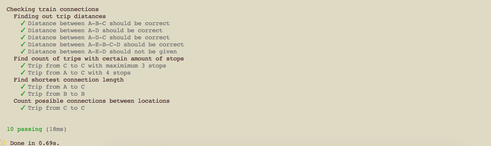
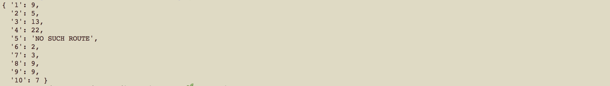

# Taking trains:
Program using directional graphs to plan train rides.

# Task: 
The local commuter railroad services a number of towns in Kiwiland.  Because of monetary concerns, all of the tracks are 'one-way.'  That is, a route from Kaitaia to Invercargill does not imply the existence of a route from Invercargill to Kaitaia.  In fact, even if both of these routes do happen to exist, they are distinct and are not necessarily the same distance!
 
The purpose of this problem is to help the railroad provide its customers with information about the routes.  In particular, you will compute the distance along a certain route, the number of different routes between two towns, and the shortest route between two towns.

# Approach:

I decided to solve this exercise using Node which allows me to easily turn the program into a web service in the future that can inform users about optimised train connections. 

As suggested in the task specifcations I used TDD which I really enjoy since it forces me to structure the task and therefore the future code beforehand. Also it makes debugging the program easier while adding new features. I picked the directed graph assigment since it is something I have never done before. I always had a special interest for data visualisation, so any issue that offers itself to be solved visually is very attractive to me. 

After making a bunch of sketches I realised that, to my surprise and out of luck, one of the subtasks can be solved with a algorithm that I just learned about. The Belman-Ford algorithm. The idea of it is to keep checking if each connection between nodes is actually the shortes one possible. Since I am a self taught programmer for the most part I constantly try to teach myself new computer science knowledge which really helped me with this task. 
It was really exciting to apply it in JS to an actual problem. 

For the last part of the exercise I represented the directed graph as a doubly nested linked list which compared to an array should have the advantage of being faster when adding nodes (here: cities)to it.  

# Output: 
For test input 1 through 5, if no such route exists, output 'NO SUCH ROUTE'.  Otherwise, follow the route as given; do not make any extra stops!  For example, the first problem means to start at city A, then travel directly to city B (a distance of 5), then directly to city C (a distance of 4).
The distance of the route A-B-C.
The distance of the route A-D.
The distance of the route A-D-C.
The distance of the route A-E-B-C-D.
The distance of the route A-E-D.
The number of trips starting at C and ending at C with a maximum of 3 stops.  In the sample data below, there are two such trips: C-D-C (2 stops). and C-E-B-C (3 stops).
The number of trips starting at A and ending at C with exactly 4 stops.  In the sample data below, there are three such trips: A to C (via B,C,D); A to C (via D,C,D); and A to C (via D,E,B).
The length of the shortest route (in terms of distance to travel) from A to C.
The length of the shortest route (in terms of distance to travel) from B to B.
The number of different routes from C to C with a distance of less than 30.  In the sample data, the trips are: CDC, CEBC, CEBCDC, CDCEBC, CDEBC, CEBCEBC, CEBCEBCEBC.
 
# Test Input:
For the test input, the towns are named using the first few letters of the alphabet from A to D.  A route between two towns (A to B) with a distance of 5 is represented as AB5.
Graph: AB5, BC4, CD8, DC8, DE6, AD5, CE2, EB3, AE7
Expected Output:
Output #1: 9
Output #2: 5
Output #3: 13
Output #4: 22
Output #5: NO SUCH ROUTE
Output #6: 2
Output #7: 3
Output #8: 9
Output #9: 9
Output #10: 7

Test output after completing task:



The whole task was a very intersting challenge for me since it requires some knowledge I have just recently acquired.
 
# Running it:

Requires Node to be installed.
I'm working with version v8.6.0.

To install dependencies ( if you do not have yarn instaled yet find the installation guide for each OS here https://yarnpkg.com/en/docs/install)
```
yarn install
```

To run tests:
```
yarn test
```

To lint code:
```
yarn lint
```

To see final output of program:
```
node index
```

Example output:


